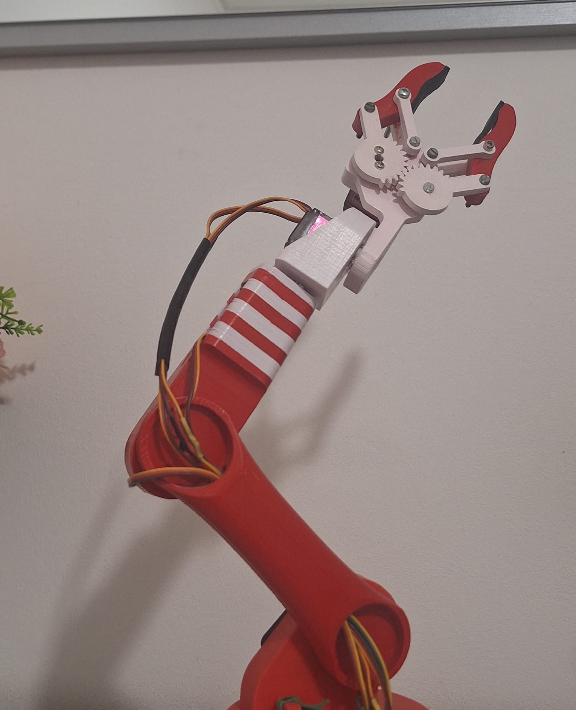
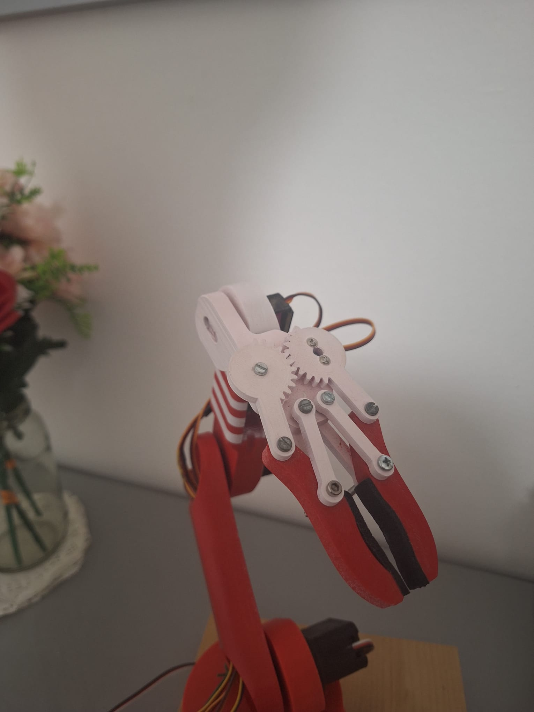

# 5-DOF Robotic Arm & Kinematics Pipeline

A complete, end-to-end mechatronics and robotics manipulation project. This repository documents the transition from a standalone embedded prototype (Arduino, direct geometric kinematics, and OpenCV-based visual servoing) to a modular, industrial-grade software architecture powered by **ROS 2 Humble**, **MoveIt 2**, **ros2_control**, and numerical/analytical kinematic solvers.

---

<p align="left">
  
  
</p>

---

## 📑 Table of Contents

1. [Key Features](https://www.google.com/search?q=%2523-key-features&utm_source=gemini)
2. [Hardware & Mechanical Architecture](https://www.google.com/search?q=%2523-hardware--mechanical-architecture&utm_source=gemini)
3. [The 5-DOF Kinematic Challenge in MoveIt 2](https://www.google.com/search?q=%2523-the-5-dof-kinematic-challenge-in-moveit-2&utm_source=gemini)
4. [Repository Structure](https://www.google.com/search?q=%2523-repository-structure&utm_source=gemini)
5. [Kinematics Benchmark](https://www.google.com/search?q=%2523-kinematics-benchmark&utm_source=gemini)
6. [Getting Started](https://www.google.com/search?q=%2523-getting-started&utm_source=gemini)
7. [Quickstart Execution](https://www.google.com/search?q=%2523-quickstart-execution&utm_source=gemini)
8. [Legacy Embedded Experiments (`without_ROS/`)](https://www.google.com/search?q=%2523-legacy-embedded-experiments-without_ros&utm_source=gemini)
9. [License](https://www.google.com/search?q=%2523-license&utm_source=gemini)

---

## 🚀 Key Features

* **5-DOF Kinematics Resolution:** Analytical closed-form solutions and deterministic seed sampling to bypass incomplete orientation constraints and numerical singularities common in under-actuated manipulators.
* **Dual Software Architecture:** Native embedded firmware (`without_ROS/`) paired alongside a clean, modular ROS 2 package workspace (`ros2_packages/`).
* **Cartesian Tool Center Point (TCP) Control:** Integrated virtual `tool0` frame positioned right between the claw fingertips to guarantee millimeter-accurate Cartesian positioning decoupled from wrist pitch.
* **ROS 2 & MoveIt 2 Industrial Stack:** Complete URDF/SRDF robot description, simulation via `FakeSystem` mock hardware controllers, and trajectory execution using `FollowJointTrajectory`.
* **Anti-Friction Mechanical Base:** Turntable base upgraded with 3 radial ball bearings to eliminate plastic friction, with ready-to-slice STL files included.
* **Interactive Visual Tracking:** Real-time face tracking with OpenCV, converting image acceleration into Cartesian velocity commands for the robot.

---

## 📸 Hardware & Mechanical Architecture

| Front View & Gripper | Wrist Detail & Flange | Side Profile & Base |
| --- | --- | --- |
|  |  |  |

### Electronics & Power Distribution

* **Main Board:** **Arduino UNO R4**, used for accurate hardware PWM signal generation and responsive serial communication.
* **Isolated Power Rails:** The primary high-torque servos (Joints 1–3) draw significant peak currents. They are powered via a **dedicated external regulated DC power supply**, sharing a common ground (GND) with the Arduino to protect digital logic from voltage drops and inductive spikes. Low-power servos (wrist and gripper) run on secondary lines.

| Axis | Joint Name | Actuator | Motion Range | Functional Description |
| --- | --- | --- | --- | --- |
| **Joint 1** | `joint_1_base_rotation` | 35g High-Torque Servo | $-90^\circ \text{ to } +90^\circ$ | Turntable rotation around the Z-axis |
| **Joint 2** | `joint_2_shoulder` | 35g High-Torque Servo | $-45^\circ \text{ to } +90^\circ$ | Shoulder pitch elevation |
| **Joint 3** | `joint_3_forearm` | 35g High-Torque Servo | $0^\circ \text{ to } +90^\circ$ | Elbow flexion and extension |
| **Joint 4** | `joint_4_wrist` | MG90S | $-90^\circ \text{ to } +90^\circ$ | Axial wrist roll |
| **Joint 5** | `joint_5_hand` | MG90S | $-90^\circ \text{ to } +90^\circ$ | Gripper pitch angle |
| **Tool** | `gripper` | MG90S | Open / Close | Parallel claw mechanism |

### Mechanical Design Details

* **3-Ball Bearing Turntable Interface:** In early prototypes, plastic-on-plastic sliding friction caused binding and jerky movements under load. The revised base features **three recessed steel ball bearings spaced at 120°**, acting as a thrust ring to take the arm's bending moments and ensure smooth, low-wear rotation.
* **Gripper Offset & TCP (`tool0`):** Because the gripper servo is side-mounted, it creates a geometric offset. Adding a virtual link `tool0` centered between the claw tips ensures the kinematics solver targets the actual contact point, eliminating positional drift when tilting the wrist.

---

## 🧠 The 5-DOF Kinematic Challenge in MoveIt 2

### The Under-Actuation Dilemma

Standard 6-axis industrial robots can reach any coordinate $(X, Y, Z)$ while independently matching any orientation $(\text{Roll}, \text{Pitch}, \text{Yaw})$ across $SE(3)$ space.

A 5-DOF serial manipulator is **under-actuated** and lacks one Cartesian degree of freedom. Querying default numerical solvers (such as KDL) with a full 6D pose typically results in:

1. **Solver failures (`Error code -31 / NO_IK_SOLUTION`)** as the math cannot satisfy all 6 constraints simultaneously.
2. **Unpredictable posture flips:** the arm suddenly jumps between elbow-up and elbow-down configurations between nearby targets.
3. **Tool tip drift:** the solver satisfies the wrist joint position, but leaving the end-effector angle unconstrained projects the claw several centimeters off target.

### Implemented Solutions in this Pipeline

```
                  ┌──────────────────────────────────────────────┐
                  │          Cartesian Goal (X, Y, Z)            │
                  └──────────────────────┬───────────────────────┘
                                         │
         ┌───────────────────────────────┼───────────────────────────────┐
         ▼                               ▼                               ▼
┌──────────────────┐           ┌──────────────────┐           ┌──────────────────┐
│  Analytical IK   │           │ Fixed-Seed KDL   │           │ Constrained TCP  │
│  (Closed-Form)   │           │ (Deterministic)  │           │ (Fixed EE Pitch) │
└────────┬─────────┘           └────────┬─────────┘           └────────┬─────────┘
         │                               │                               │
         ▼                               ▼                               ▼
Exact joint angles             Biased optimization             MoveIt solves 1-4,
in < 0.1 ms (Geometric)        avoids branch flips             Joint 5 set by rule

```

#### 1. Deterministic Fixed Seed State (`test1_seedFisso.py`)

Instead of letting KDL start from an arbitrary seed, each `/compute_ik` request receives a fixed initial state $\mathbf{q}_{\text{seed}} = [0.0, 0.35, -0.70, 0.0, 0.0]$. This biases the numerical optimizer toward a stable elbow-up configuration, preventing abrupt configuration flips during continuous paths.

#### 2. Direct End-Effector Pitch Decoupling (`test1_pinzaFissa.py`)

MoveIt solves Cartesian coordinates $(X, Y, Z)$ for the first four joints using `position_only_ik: true`. The script intercepts `joint_5_hand` and computes its angle directly:


$$\theta_5 = -(\theta_2 + \theta_3) + \phi_{\text{target}}$$


This keeps the gripper level with the ground or vertical for top-down picks regardless of arm extension.

#### 3. Closed-Form Geometric Inverse Kinematics (`analytical_sol.py`)

A fast trigonometric solver that bypasses MoveIt completely:

* **Base Angle:** $\theta_1 = \text{atan2}(y, x)$ calculated on the horizontal plane.
* **Planar Kinematics:** Computes decoupled wrist coordinates $(r_w, z_w)$ to isolate pitch, then applies the Law of Cosines for shoulder and elbow.
* **Performance:** Solves in under $100\,\mu\text{s}$ with zero convergence failures and 100% repeatability.

---

## 📁 Repository Structure

```text
.
├── docs/                            # Documentation assets
│   └── images/                      # Hardware photos and simulation media
│       ├── gripper_front.jpeg
│       ├── wrist_detail.jpeg
│       └── side_profile.jpeg
│
├── mechanical/                      # CAD files and 3D printing models
│   ├── images/                      # Exploded renders and assembly views
│   └── print_ready/                 # STL files ready for slicing
│       ├── base_turntable_bearings.stl
│       ├── shoulder_link.stl
│       ├── forearm_link.stl
│       ├── wrist_link.stl
│       └── gripper_claws.stl
│
├── without_ROS/                     # Early standalone embedded scripts
│   ├── braccio_IK_convertito.ino    # Arduino C++ geometric kinematics firmware
│   ├── cvzone face_det_accle_xy.py  # OpenCV face tracking with serial transmission
│   ├── ik_coseno.ino                # Law of Cosines implementation on microcontrollers
│   └── IK.py                        # Hardware calibration script via pyFirmata
│
└── ros2_packages/                   # ROS 2 workspace source packages
    ├── mio_progetto/                # Custom kinematics and trajectory control nodes
    │   ├── mio_progetto/
    │   │   ├── analytical_sol.py    # Closed-form geometric 5-DOF IK engine
    │   │   ├── ikpy_to_rviz.py      # 50 Hz IKPy RViz publisher
    │   │   ├── test_moveit_5dof.py  # MoveIt GetPositionIK client (position-only)
    │   │   ├── test1_pinzaFissa.py  # Decoupled gripper pitch compensation node
    │   │   └── test1_seedFisso.py   # Deterministic fixed-seed IK execution node
    │   ├── package.xml
    │   └── setup.py
    │
    ├── robotic_arm_description/     # Parametric URDF model, meshes, and tool0 frame
    └── robotic_arm_moveit_config/   # MoveIt 2 configuration (kinematics.yaml, SRDF, launch)
        ├── config/
        │   ├── kinematics.yaml      # KDL parameters, tolerances, and position_only_ik
        │   └── robotic_arm_5dof.srdf# Planning groups and collision disable pairs
        └── launch/
            └── demo.launch.py       # Launch file for RViz2, MoveGroup, and FakeSystem

```

---

## 📊 Kinematics Benchmark

| Metric / Parameter | MoveIt 2 (KDL Default) | MoveIt 2 (Fixed Seed) | IKPy Optimizer | Geometric Analytical |
| --- | --- | --- | --- | --- |
| **Computation Latency** | $\sim 5\text{--}15\text{ ms}$ | $\sim 5\text{ ms}$ | $\sim 2\text{--}4\text{ ms}$ | **$< 0.1\text{ ms}$** |
| **Deterministic Output** | ❌ No (Prone to flips) | ⚠️ High (Seed-locked) | ⚠️ Sensitive to seed | ✅ **100% Deterministic** |
| **Orientation Handling** | Requires 6D Pose | Position-Only (`tool0`) | Position-Only Mask | Explicit Pitch Control |
| **Environment Collisions** | ✅ Full Octomap/Scene | ✅ Full Octomap/Scene | ❌ Link limits only | ❌ Software bounds only |
| **Resource Overhead** | High (MoveGroup stack) | High (MoveGroup stack) | Low (Python package) | **Minimal (Arduino R4 ready)** |

---

## ⚙️ Getting Started

### System Prerequisites

* **Operating System:** Ubuntu 22.04 LTS or WSL2 (Ubuntu 22.04)
* **ROS Version:** ROS 2 Humble Desktop
* **MoveIt 2:** `ros-humble-moveit` and `ros2_control` packages
* **Python Libraries:** `ikpy`, `numpy`, `opencv-python`

```bash
sudo apt update
sudo apt install -y ros-humble-moveit ros-humble-ros2-control ros-humble-ros2-controllers
pip install ikpy numpy opencv-python

```

### Workspace Setup & Build

```bash
# 1. Create your ROS 2 workspace
mkdir -p ~/ros2_ws/src
cd ~/ros2_ws/src

# 2. Clone the repository into src/
git clone https://github.com/kushalgollen/5-DOF-Robotic-Arm-and-Kinematics-Pipeline.git .

# 3. Build using colcon
cd ~/ros2_ws
colcon build --symlink-install
source install/setup.bash

```

---

## ⚡ Quickstart Execution

### 1. Launch MoveIt 2 Simulation

Start the `move_group` node, RViz2, and the simulated hardware controllers:

```bash
ros2 launch robotic_arm_moveit_config demo.launch.py

```

### 2. Run the Fixed-Seed Controller

In another terminal, send a Cartesian target using MoveIt with the fixed seed:

```bash
source ~/ros2_ws/install/setup.bash
ros2 run mio_progetto test1_seedFisso

```

### 3. Run the Analytical Geometric Solver

For instant calculation with direct tool pitch control:

```bash
source ~/ros2_ws/install/setup.bash
ros2 run mio_progetto analytical_sol

```

### 4. Run High-Frequency IKPy RViz Streaming

Stream continuous Cartesian movement at 50 Hz without MoveIt overhead:

```bash
source ~/ros2_ws/install/setup.bash
ros2 run mio_progetto ikpy_to_rviz

```

---

## 🕹️ Legacy Embedded Experiments (`without_ROS/`)

Before porting to ROS 2, the arm ran as a standalone prototype:

* **`braccio_IK_convertito.ino` & `ik_coseno.ino`:** Real-time geometric inverse kinematics written in bare-metal C++ executing on an Arduino board.
* **`cvzone face_det_accle_xy.py`:** Webcam vision pipeline that tracks face movement, estimates pixel acceleration, and sends motion deltas over serial.
* **`IK.py`:** USB servo control script using `pyFirmata` for initial joint calibration and workspace checks.

---

## 📄 License

This project is licensed under the MIT License - see the [LICENSE](https://www.google.com/search?q=LICENSE&utm_source=gemini) file for details.